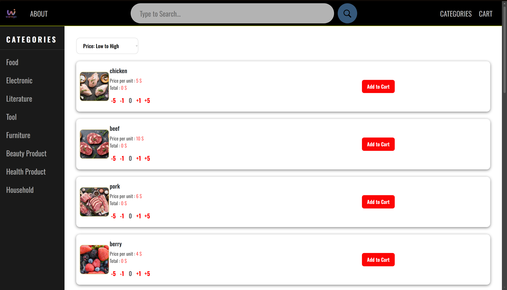
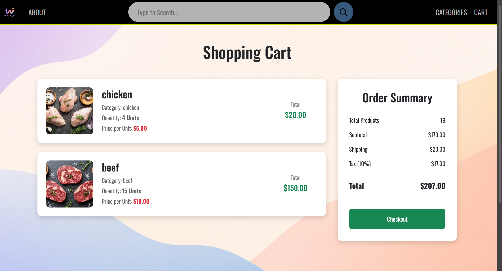

---
A modern B2B e-commerce prototype web app built with Laravel, PHP, Blade, MySQL

## Overview

WareGo is an e-commerce website designed for supermarket owners for easy inventory restocking.
The website provides a simple interface for browsing products by their respective categories, searching for products, managing a shopping cart, and sorting products.
The purpose of WareGo is to help supermarket owners quickly locate products, view the pricing, and prepare their shipment order through a user friendly web interface.

## Motivation

We found inspiration from our real life experiences. We were playing a
supermarket simulator game and we found the inventory management/product restock feature to be pretty cool!

We thought it would be a somewhat realistic project to try and apply what we learned during the summer semester!

## Tech Stack

- Laravel
- PHP
- Blade
- HTML5
- CSS3
- JavaScript
- Bootstrap
- MySQL

## Screenshots




## Setup Guide

### Prerequisites

Before running the project, make sure you have the following installed:

- PHP 8.x
- Composer
- MySQL
- Laravel Herd

---

### 1. Clone the repository

```bash
git clone https://github.com/cy181/WareGo.git
cd WareGo
```

### 2. Install dependencies

```bash
composer install
npm install
```

### 3. Create the environment file

```bash
cp .env.example .env
```

### 4. Configure the database

Update the `.env` file with your MySQL database credentials.

Example:

```env
DB_CONNECTION=mysql
DB_HOST=127.0.0.1
DB_PORT=3306
DB_DATABASE=warego
DB_USERNAME=root
DB_PASSWORD=YOUR_PASSWWORD
```

### 5. Generate the application key

```bash
php artisan key:generate
```

### 6. Import the database

1. Open **MySQL Workbench**.
2. Connect to your local MySQL server.
3. Create a new database (e.g., `warego`).
4. Go to **Server → Data Import**.
5. Select **Import from Self-Contained File** and choose the provided `warego.sql` file.
6. Select the `warego` database as the target schema.
7. Click **Start Import**.

After importing, ensure your `.env` file uses the same database name.

### 7. Build the frontend assets

```bash
npm run dev
```

### 8. Open the project with Laravel Herd

If you do not already have Laravel Herd installed, download and install it from the official website:
https://herd.laravel.com/

Once installed:

1. Open **Laravel Herd**.
2. Click **Add Existing Site**.
3. Browse to and select the **WareGo** project folder.
4. Click **Add Site**.
5. Herd will automatically configure and serve the project.
6. Once the site has been added, click **Open Site** (or open the URL shown by Herd in your browser).

The web application will typically be available at:

```
http://warego.test
```

> **Note:** If Herd assigns a different domain name, use the URL displayed in the Herd application.